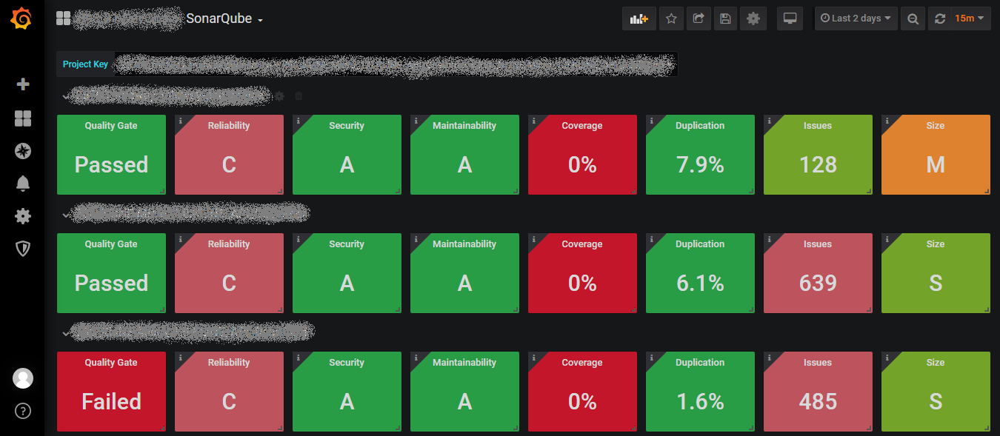
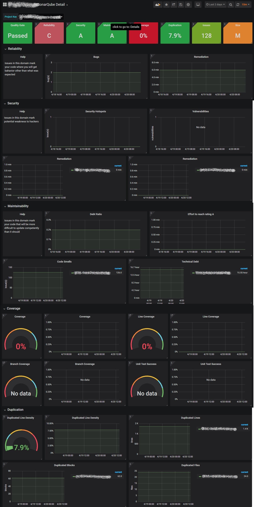

# SonarQube Exporter

Usage:
```
usage: sqe [-h] --url URL --access-token ACCESS_TOKEN [--interval INTERVAL]
           [--ignore-ssl-verification] [--log-level LOG_LEVEL] [--port PORT]
           [--storage-info] [--users]

optional arguments:
  -h, --help            show this help message and exit
  --url URL             SonarQube URL which will be monitored
  --user-token USER_TOKEN
                        Access token used for authentication against
                        SonarQube
  --interval INTERVAL   Interval in seconds
  --ignore-ssl-verification
  --log-level LOG_LEVEL
                        Log level. It can be DEBUG, INFO, WARNING, ERROR,
                        CRITICAL. Default is INFO
  --port PORT, -p PORT  The port that SQE will listen on. Default is 8999
```
Docker:
```bash
docker run -d -p 8999:8999 nthienan/sonarqube-exporter sqe --url https://sonarqube.example.com --user-token <USER_TOKEN>
```
Metrics:
```
sonar_alert_status{domain="Releasability",id="AW-NxaX2uqnNHCRHu3Px",key="sample-project",name="sample-project",type="LEVEL",value="OK"}	0
sonar_bugs{domain="Reliability",id="AW-NxaX2uqnNHCRHu3Px",key="sample-project",name="sample-project",type="INT"}	2
sonar_classes{domain="Size",id="AW-NxaX2uqnNHCRHu3Px",key="sample-project",name="sample-project",type="INT"}	23
sonar_code_smells{domain="Maintainability",id="AW-NxaX2uqnNHCRHu3Px",key="sample-project",name="sample-project",type="INT"}	196
sonar_cognitive_complexity{domain="Complexity",id="AW-NxaX2uqnNHCRHu3Px",key="sample-project",name="sample-project",type="INT"}	707
sonar_comment_lines{domain="Size",id="AW-NxaX2uqnNHCRHu3Px",key="sample-project",name="sample-project",type="INT"}	105
sonar_comment_lines_density{domain="Size",id="AW-NxaX2uqnNHCRHu3Px",key="sample-project",name="sample-project",type="PERCENT"}	1.3
sonar_complexity{domain="Complexity",id="AW-NxaX2uqnNHCRHu3Px",key="sample-project",name="sample-project",type="INT"}	1372
sonar_confirmed_issues{domain="Issues",id="AW-NxaX2uqnNHCRHu3Px",key="sample-project",name="sample-project",type="INT"}	0
sonar_coverage{domain="Coverage",id="AW-NxaX2uqnNHCRHu3Px",key="sample-project",name="sample-project",type="PERCENT"}	0
sonar_development_cost{domain="Maintainability",id="AW-NxaX2uqnNHCRHu3Px",key="sample-project",name="sample-project",type="STRING"}	233790
sonar_duplicated_blocks{domain="Duplications",id="AW-NxaX2uqnNHCRHu3Px",key="sample-project",name="sample-project",type="INT"}	10
sonar_duplicated_files{domain="Duplications",id="AW-NxaX2uqnNHCRHu3Px",key="sample-project",name="sample-project",type="INT"}	7
sonar_duplicated_lines{domain="Duplications",id="AW-NxaX2uqnNHCRHu3Px",key="sample-project",name="sample-project",type="INT"}	270
sonar_duplicated_lines_density{domain="Duplications",id="AW-NxaX2uqnNHCRHu3Px",key="sample-project",name="sample-project",type="PERCENT"}	3.1
sonar_effort_to_reach_maintainability_rating_a{domain="Maintainability",id="AW-NxaX2uqnNHCRHu3Px",key="sample-project",name="sample-project",type="WORK_DUR"}	0
sonar_false_positive_issues{domain="Issues",id="AW-NxaX2uqnNHCRHu3Px",key="sample-project",name="sample-project",type="INT"}	0
sonar_file_complexity{domain="Complexity",id="AW-NxaX2uqnNHCRHu3Px",key="sample-project",name="sample-project",type="FLOAT"}	15.6
sonar_files{domain="Size",id="AW-NxaX2uqnNHCRHu3Px",key="sample-project",name="sample-project",type="INT"}	107
sonar_functions{domain="Size",id="AW-NxaX2uqnNHCRHu3Px",key="sample-project",name="sample-project",type="INT"}	787
sonar_line_coverage{domain="Coverage",id="AW-NxaX2uqnNHCRHu3Px",key="sample-project",name="sample-project",type="PERCENT"}	0
sonar_lines{domain="Size",id="AW-NxaX2uqnNHCRHu3Px",key="sample-project",name="sample-project",type="INT"}	8689
sonar_lines_to_cover{domain="Coverage",id="AW-NxaX2uqnNHCRHu3Px",key="sample-project",name="sample-project",type="INT"}	1598
sonar_ncloc{domain="Size",id="AW-NxaX2uqnNHCRHu3Px",key="sample-project",name="sample-project",type="INT"}	7793
sonar_open_issues{domain="Issues",id="AW-NxaX2uqnNHCRHu3Px",key="sample-project",name="sample-project",type="INT"}	198
sonar_reliability_rating{domain="Reliability",id="AW-NxaX2uqnNHCRHu3Px",key="sample-project",name="sample-project",type="RATING"}	3
sonar_reliability_remediation_effort{domain="Reliability",id="AW-NxaX2uqnNHCRHu3Px",key="sample-project",name="sample-project",type="WORK_DUR"}	10
sonar_reopened_issues{domain="Issues",id="AW-NxaX2uqnNHCRHu3Px",key="sample-project",name="sample-project",type="INT"}	0
sonar_security_hotspots{domain="Security",id="AW-NxaX2uqnNHCRHu3Px",key="sample-project",name="sample-project",type="INT"}	2
sonar_security_rating{domain="Security",id="AW-NxaX2uqnNHCRHu3Px",key="sample-project",name="sample-project",type="RATING"}	1
sonar_security_remediation_effort{domain="Security",id="AW-NxaX2uqnNHCRHu3Px",key="sample-project",name="sample-project",type="WORK_DUR"}	0
sonar_security_review_rating{domain="Security",id="AW-NxaX2uqnNHCRHu3Px",key="sample-project",name="sample-project",type="RATING"}	1
sonar_sqale_debt_ratio{domain="Maintainability",id="AW-NxaX2uqnNHCRHu3Px",key="sample-project",name="sample-project",type="PERCENT"}	0.5
sonar_sqale_index{domain="Maintainability",id="AW-NxaX2uqnNHCRHu3Px",key="sample-project",name="sample-project",type="WORK_DUR"}	1110
sonar_sqale_rating{domain="Maintainability",id="AW-NxaX2uqnNHCRHu3Px",key="sample-project",name="sample-project",type="RATING"}	1
sonar_statements{domain="Size",id="AW-NxaX2uqnNHCRHu3Px",key="sample-project",name="sample-project",type="INT"}	1600
sonar_violations{domain="Issues",id="AW-NxaX2uqnNHCRHu3Px",key="sample-project",name="sample-project",type="INT"}
```

Overview dashboard:


Details dashboard:

